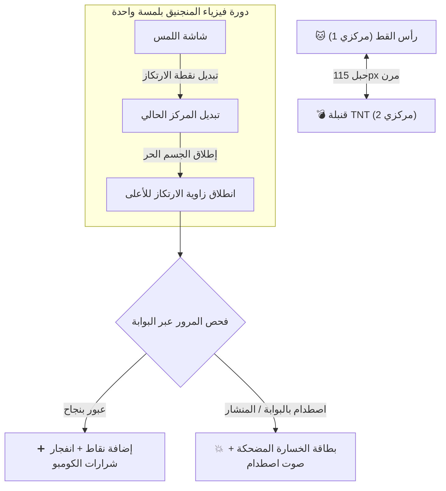
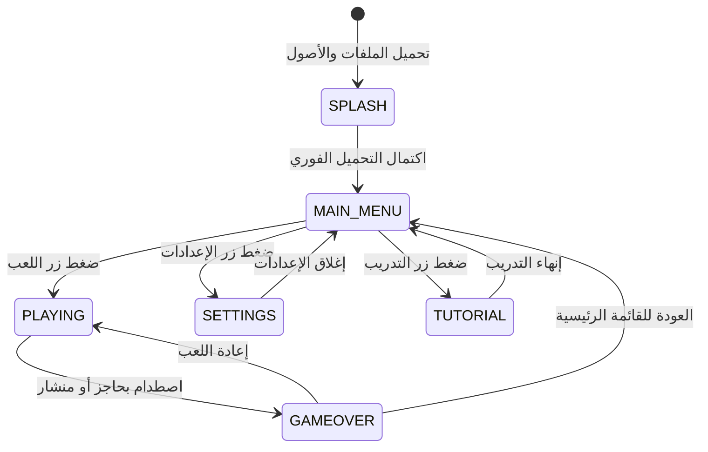

# 🐱💥 Tether Trouble: Chop & Drop | لعبة حبل المنجنيق النيون

<div align="center">
  
</div>

<div align="center">

**اللغة / Language:** **العربية** | [English](README.md)

</div>

> **لعبة أركيد فيزياء سريعة ومثيرة تعمل بلمسة واحدة على الجوال، مبنية باستخدام React Native و Expo (SDK 57).**  
> *فيزياء المنجنيق بلمسة واحدة • صور PNG سايبربانك • محرك سريع 60 FPS • دعم كامل للغتين العربية والإنجليزي مع اتجاه RTL*

[](LICENSE)
[](https://docs.expo.dev/)
[](https://reactnative.dev/)
[](https://www.typescriptlang.org/)

---

## 🌟 آلية اللعب والفيزياء (Overview & Gameplay)

تعتمد **Tether Trouble** على محرك فيزياء المهد المحوري الممتع والمصمم للعمل بلمسة واحدة: **رأس قط السايبربانك النيون وقنبلة TNT المتفجرة مرتبطين بحبل مرن بحجم 115px.**

> [!TIP]
> **طريقة اللعب:**  
> 1. **التأرجح المستمر (Continuous Pendulum Swing):** تدور الشخصيتان حول بعضهما في مسار دائري سلس وسريع.  
> 2. **الضغط للتبديل والإنطلاق (Tap to Sling):** اضغط في أي مكان على الشاشة لتبديل مركز الدوران فوراً وإطلاق الشخصية الحرة للأعلى كالمنجنيق.  
> 3. **تفادي العقبات النيون (Dodge Neon Gates & Sawblades):** اعبر بين الحواجز والمناشير الدوارة بدون أي اصطدام لتحقيق أعلى نقاط وسلسلة كومبو (Combo Multiplier).



---

## ⚡ المميزات الرئيسية (Key Features)

- 🐱 **رسومات عالية الدقة (`assets/sprites/`):** صور 3D PNG شفافة مخصصة للقط، القنبلة، المناشير، النجوم، البوابات، الليزر، والشرارات.
- ⏳ **تحميل مسبق محدد (`SplashScreen`):** شاشة تحميل حقيقية ومباشرة تنقل المستخدم فور اكتمال جاهزية الكود دون أي انتظام اصطناعي.
- 🌐 **دعم كامل للغتين العربية والإنجليزي (`src/i18n/`):** دعم شامل لاتجاه النص **RTL (من اليمين إلى اليسار)** للعربية و **LTR** للإنجليزي.
- 🎮 **تحكم بلمسة واحدة (1-Tap):** استجابة سريعة جداً للمسات خلال 100 ملي ثانية.
- ⚡ **أداء 60 إطار في الثانية (60 FPS):** محرك SVG محوري يعمل بتزامن كامل خارج معالجات React الثقيلة.
- 🔊 **مخلق أصوات فوري (Procedural Audio Synthesizer):** محرك أصوات بدون مكتبات خارجية ينتج مؤثرات القفز، المنجنيق، والاصطدام فوراً.
- 📳 **اهتزازات تفاعلية (Haptic Feedback):** تفعيل اهتزازات الجهاز مع اللمس، الكومبو، والاصطدامات.
- 📸 **بطاقات خسارة مضحكة (Viral Meme Fail Cards):** شاشات خسارة ديناميكية تولد عبارات عربية مضحكة مثل (*"الفيزياء غادرت المحادثة 💀"*) وزر مشاركة سريع.
- 🏆 **حفظ الأرقام القياسية:** تخزين سريع 0ms واسترجاع مباشر للبيانات عبر `@react-native-async-storage/async-storage`.

---

## 🏗️ معمارية التطبيق ومخطط الشاشات



---

## 📁 هيكل المجلدات والمشروع

```text
tether-trouble/
├── .agents/
│   ├── AGENTS.md                  # قواعد المشروع واختيارات الألوان
│   └── ARCHITECTURE.md            # المخطط الهندسي ومعادلات الفيزياء
├── app/
│   ├── _layout.tsx                # تخطيط Expo Router مع شاشة التحميل الأصلية
│   └── index.tsx                  # مسار تشغيل Expo Router الرئيسي
├── assets/
│   ├── icon.png                   # أيقونة التطبيق الرئيسية 1024x1024
│   ├── docs/                      # صورة البانر العريضة
│   │   └── banner.png             # 16:9 Landscape Hero Banner
│   └── sprites/                   # صور عناصر اللعبة PNG
│       ├── cat.png                # رأس قط السايبربانك (256x256)
│       ├── bomb.png               # قنبلة TNT المتفجرة (256x256)
│       ├── sawblade.png           # المنشار النيون (256x256)
│       ├── star.png               # نجمة الشرارات (128x128)
│       ├── gate.png               # حاجز النيون (256x128)
│       ├── laser.png              # شعاع الليزر (256x64)
│       ├── spark.png              # شرارة الاصطدام (128x128)
│       └── rope_anchor.png        # حلقة ارتكاز الحبل (128x128)
├── src/
│   ├── assets/
│   │   └── spriteAssets.ts        # سجل الصور الرئييسية
│   ├── i18n/
│   │   ├── ar.json                # قاموس الترجمة العربية
│   │   ├── en.json                # قاموس الترجمة الإنجليزية
│   │   ├── I18nService.ts         # مدير اللغة والتخزين
│   │   └── index.ts               # تصدير ملفات الترجمة
│   ├── services/
│   │   ├── AssetPreloaderService.ts  # محمل الصور والأصوات
│   │   ├── AudioHapticsService.ts    # مخلق الأصوات والاهتزاز
│   │   └── StorageService.ts         # خدمة التخزين السريع
│   ├── screens/
│   │   ├── SplashScreen/          # شاشة التحميل المبدئية
│   │   ├── MainMenu/              # شاشة القائمة الرئيسية
│   │   ├── Game/                  # شاشة اللعب والفيزياء
│   │   ├── GameOver/              # شاشة الخسارة وبطاقات الكومبو
│   │   └── Settings/              # شاشة الإعدادات واللغة
│   ├── components/
│   │   ├── GameCanvas/            # لوحة رسم SVG لرسومات اللعبة
│   │   ├── ScoreHUD/              # واجهة النقاط والكومبو
│   │   └── LanguageSwitcher/      # زر تغيير اللغة AR / EN
│   └── game/
│       └── engine/
│           └── PhysicsEngine.ts   # محرك فيزياء البندول والارتكاز
├── App.tsx                        # مكون التطبيق الرئيسي
├── app.json                       # إعدادات Expo
├── package.json                   # حزم وتوابع المشروع
├── README.md                      # التوثيق باللغة الإنجليزية
├── README.ar.md                   # التوثيق باللغة العربية
└── LICENSE                        # رخصة AGPL-3.0
```

---

## 🚀 تشغيل وبناء التطبيق (Running & Building)

### 1. المتطلبات الأساسية
- Node.js (v18+)
- Expo CLI (`npx expo`)
- OpenJDK 21 و Android SDK (لبناء ملف ה-APK)

### 2. وضع التطوير
```bash
# تثبيت التوابع والحزم
npm install

# تشغيل خادم تطوير Expo
npm start

# التشغيل على محاكي Android
npm run android
```

### 3. بناء تطبيق Android APK مستقل
لتجميع وبناء ملف `.apk` أوفلاين مستقل ومباشر في المجلد الرئيسي (`./TetherTrouble.apk`):
```bash
npm run build:apk
```

---

## 📜 رخصة المصدر المفتوح

هذا المشروع مرخص بموجب **GNU Affero General Public License v3.0 (AGPL-3.0)**.

> أي جهة تقوم بتعديل أو توزيع هذا الكود، أو استخدامه لتقديم خدمات سحابية، **يجب عليها نشر السورس كود كاملاً بموجب نفس رخصة AGPL-3.0.** اراجع ملف [LICENSE](LICENSE) للتفاصيل القانونية.
