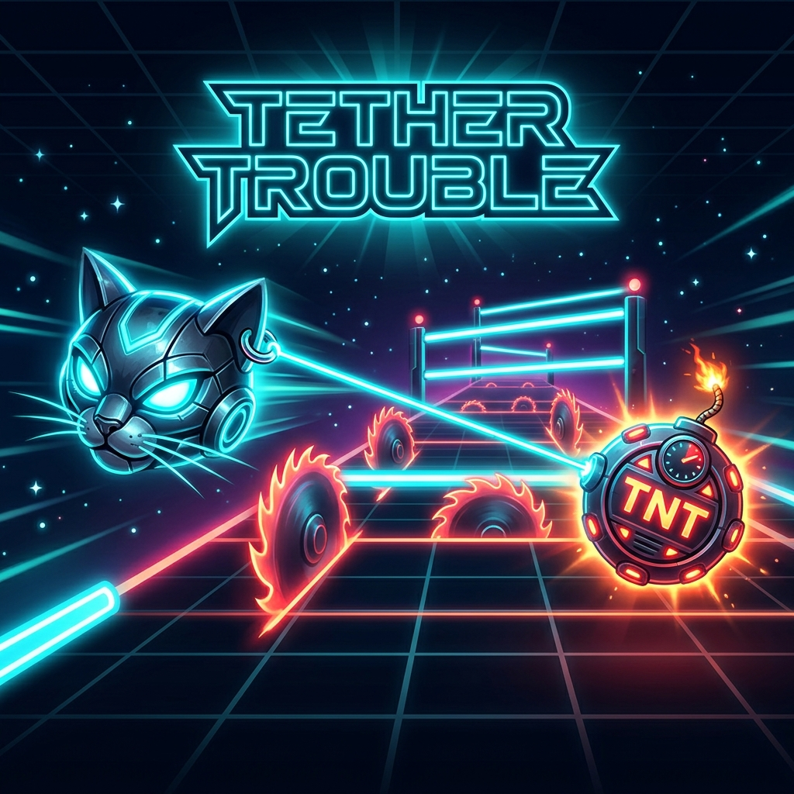
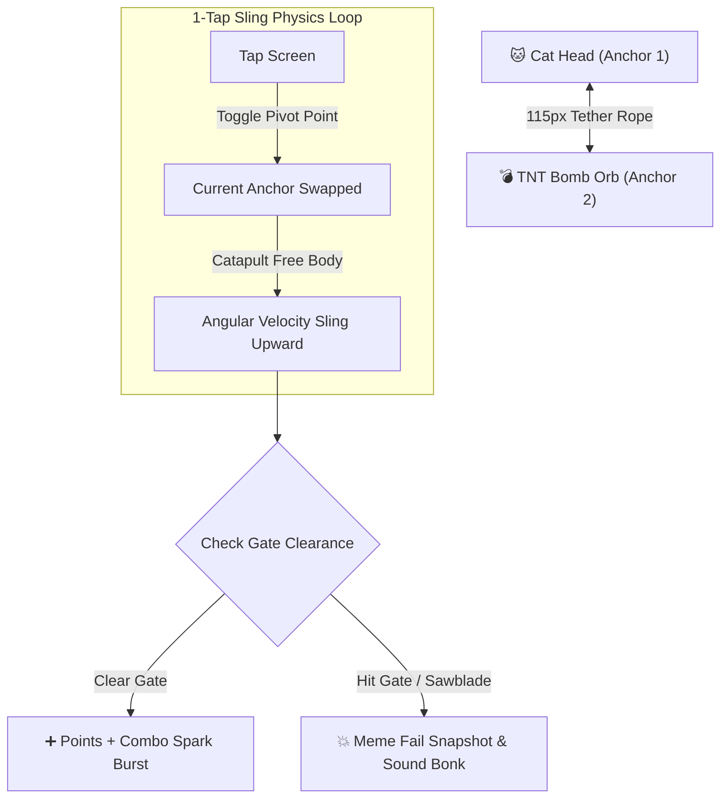
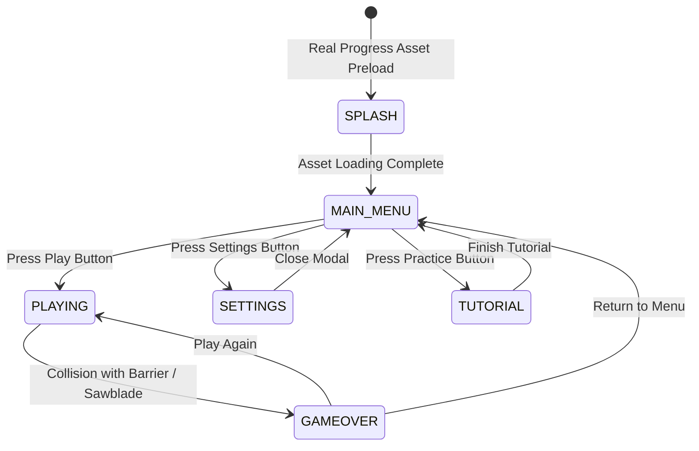

# 🐱💥 Tether Trouble: Chop & Drop

<div align="center">
  
</div>

<div align="center">

**Language / اللغة:** **English** | [العربية](README.ar.md)

</div>

> **A high-octane, hyper-addictive 1-tap mobile physics arcade game built with React Native & Expo (SDK 57).**  
> *1-Tap Pendulum Mechanics • Cyberpunk PNG Sprites • 60 FPS Dynamic Engine • AR/EN i18n with RTL*

[](LICENSE)
[](https://docs.expo.dev/)
[](https://reactnative.dev/)
[](https://www.typescriptlang.org/)

---

## 🌟 Overview & Gameplay Mechanics

**Tether Trouble** is built around a single, highly satisfying 1-tap pendulum physics engine: **a mischievous Cyberpunk Cat head and an explosive TNT Bomb orb tethered together by a dynamic 115px elastic rope.**

> [!TIP]
> **How to Play:**  
> 1. **Continuous Pendulum Swing:** The two characters orbit each other in a smooth, continuous rotational arc.  
> 2. **Tap to Sling:** Tap anywhere on the screen to instantly swap the pivot point and catapult the free character upward like a slingshot.  
> 3. **Dodge Obstacles & Sawblades:** Weave between neon barriers and spinning sawblades without crashing to build high scores and combo multipliers.



---

## ⚡ Key Features

- 🐱 **High-Resolution PNG Sprite Inventory (`assets/sprites/`):** Custom 3D transparent PNG game graphics for Cat, Bomb, Sawblades, Stars, Gates, Lasers, Sparks, and Rope Anchors.
- ⏳ **Deterministic Asset Preloader (`SplashScreen`):** Real-time loading progress (`0%` to `100%`) pre-warming PNG image sprites, storage, and audio before entering gameplay.
- 🌐 **Arabic & English i18n System (`src/i18n/`):** Full bilingual support with dynamic **RTL (Right-to-Left)** layout formatting for Arabic and **LTR** for English.
- 🎮 **1-Tap Controls:** Simple 100ms gesture response. Tap anywhere to toggle pivot and catapult forward.
- ⚡ **60 FPS Performance:** Dynamic SVG physics engine operating synchronously outside heavy React re-renders.
- 🔊 **Zero-Latency Procedural Audio Synthesizer:** Pure Web Audio / Expo AudioContext synthesizer producing snappy pops, spring slings, near-miss chimes, and crash bonks.
- 📳 **Tactile Haptic Feedback:** Integrated `expo-haptics` providing physical feedback for taps, combos, and collisions.
- 📸 **Viral Meme Fail Cards:** Dynamic freeze-frame fail snapshot screens generating hilarious quotes in Arabic and English (*"Physics left the chat 💀"*) and 1-tap social share card.
- 🏆 **High Score & Stats Persistence:** In-memory cached storage for instant `0ms` reads and non-blocking background saves via `@react-native-async-storage/async-storage`.

---

## 🏗️ Architecture & Screen Flow



---

## 📁 Repository Directory Structure

```text
tether-trouble/
├── .agents/
│   ├── AGENTS.md                  # Project rules, color palettes, and coding standards
│   └── ARCHITECTURE.md            # System blueprint, pendulum math, and data flow
├── app/
│   ├── _layout.tsx                # Expo Router root Stack layout with splash screen integration
│   └── index.tsx                  # Expo Router index route
├── assets/
│   ├── icon.png                   # Main 1024x1024 app icon
│   ├── docs/                      # High resolution wide banner hero image
│   │   └── banner.png             # 16:9 Landscape Hero Banner
│   └── sprites/                   # Transparent PNG Game Sprites
│       ├── cat.png                # Cyberpunk Cat character (256x256)
│       ├── bomb.png               # Explosive TNT bomb orb (256x256)
│       ├── sawblade.png           # Neon sawblade hazard (256x256)
│       ├── star.png               # Spark star particle (128x128)
│       ├── gate.png               # Neon barrier gate (256x128)
│       ├── laser.png              # Laser hazard beam (256x64)
│       ├── spark.png              # Collision spark particle (128x128)
│       └── rope_anchor.png        # Rope pivot ring anchor (128x128)
├── src/
│   ├── assets/
│   │   └── spriteAssets.ts        # Centralized PNG sprite registry
│   ├── i18n/
│   │   ├── ar.json                # Arabic translation dictionary
│   │   ├── en.json                # English translation dictionary
│   │   ├── I18nService.ts         # Localization manager & persistence
│   │   └── index.ts               # i18n barrel export
│   ├── services/
│   │   ├── AssetPreloaderService.ts  # Preloads images, storage, audio, & i18n
│   │   ├── AudioHapticsService.ts    # Procedural AudioContext synth & haptics
│   │   └── StorageService.ts         # In-memory cached async storage service
│   ├── screens/
│   │   ├── SplashScreen/          # Preloader screen with real progress bar
│   │   ├── MainMenu/              # Minimal arcade main menu screen
│   │   ├── Game/                  # Playable gameplay canvas view
│   │   ├── GameOver/              # Localized fail snapshot & rank badge modal
│   │   └── Settings/              # Language, sound & stats modal
│   ├── components/
│   │   ├── GameCanvas/            # SVG canvas rendering PNG sprites
│   │   ├── ScoreHUD/              # Floating score & combo multiplier HUD
│   │   └── LanguageSwitcher/      # Reusable AR / EN toggle button
│   └── game/
│       └── engine/
│           └── PhysicsEngine.ts   # Pendulum vector math & collision engine
├── App.tsx                        # Top-level screen state machine
├── app.json                       # Expo manifest configuration
├── package.json                   # Project dependencies and build scripts
├── README.md                      # English documentation
├── README.ar.md                   # Arabic documentation
└── LICENSE                        # GNU AGPL-3.0 License
```

---

## 🚀 Running & Building the App

### 1. Prerequisites
- Node.js (v18+)
- Expo CLI (`npx expo`)
- OpenJDK 21 & Android SDK (for building APK)

### 2. Development Mode
```bash
# Install dependencies
npm install

# Start Expo dev server
npm start

# Run on Android Emulator
npm run android
```

### 3. Build Standalone Android APK
To compile and generate a standalone `.apk` directly in the project root (`./TetherTrouble.apk`):
```bash
npm run build:apk
```

---

## 📜 Open Source License

This project is licensed under the **GNU Affero General Public License v3.0 (AGPL-3.0)**.

> Anyone modifying or distributing this codebase, or using it to host network/cloud services, **must disclose the complete source code under the same AGPL-3.0 license terms.** See the [LICENSE](LICENSE) file for full legal details.
